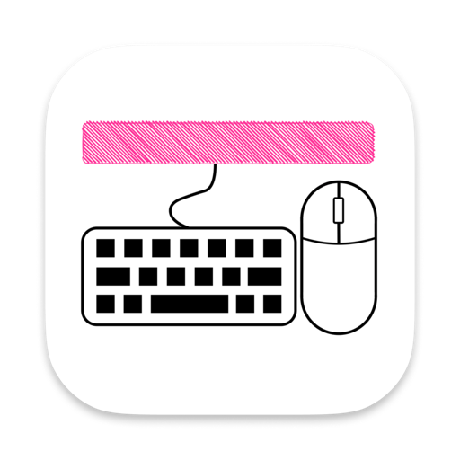
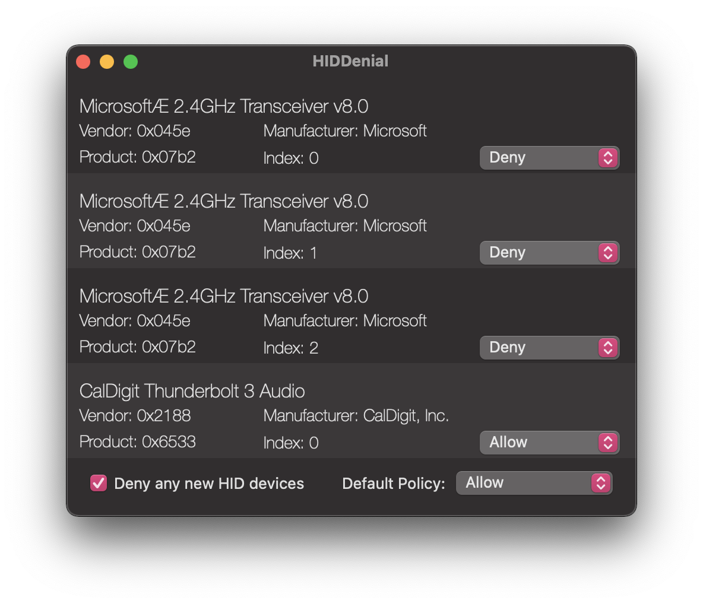

<div align="center">
	
	<h1>HIDDenial</h1>
	<p>
		<b>An macOS application that prevents HID injection attacks.</b>
  </p>
	<br>
	<br>
	<br>
</div>


# HIDDenial



Feel worried about the USB device you're about to plugging in to your Mac?

Here comes the HIDDenial to rescue! And now you can choose to deny/block all new HID devices.

### Note
You need to run the application as root in order to intercept all unwanted HID devices.

```bash
sudo /Applications/HIDDenial.app/Contents/MacOS/HIDDenial
```

Technically, I should make it a separate `launched` helper program, but that would add one more running program in the background that you don't really need for most of the time.

